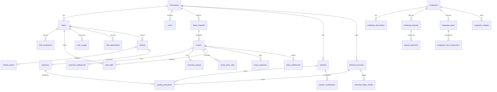

# Database Design

The schema for the Dairy Management System. Tables are created phase by phase;
this document is both the agreed target and a record of what exists.

Each group below is marked with its status. Where the built schema differs from
the Phase 0 plan the difference is stated and explained rather than quietly
edited away, because the reason a planned column was not built is the useful
part.

As of **Phase 5**, implemented: Group A in full, Group B except `employees`, Group D in
full, Group E in full, and Group F in full. Groups C and G and the notifications table
are still plans.

Conventions, all of which are enforced rather than encouraged:

| Concern         | Rule                                                             |
| --------------- | ---------------------------------------------------------------- |
| Table names     | lowercase `snake_case`, plural (see [DECISIONS.md](DECISIONS.md) D6) |
| Primary keys    | `BIGINT UNSIGNED AUTO_INCREMENT`                                 |
| Milk quantity   | `DECIMAL(10,3)` — litres to 3 decimal places                     |
| Money           | `DECIMAL(14,2)`                                                  |
| Rates           | `DECIMAL(10,2)`                                                  |
| Fat / SNF       | `DECIMAL(5,2)`                                                   |
| Business dates  | `DATE`, never a timestamp (D7)                                   |
| Enumerations    | `VARCHAR` backed by a PHP enum, not MySQL `ENUM`                 |
| Polymorphic ref | stable morph-map alias, never a class name (D10)                 |
| Engine          | InnoDB, `utf8mb4` / `utf8mb4_0900_ai_ci`                         |

Floating point is never used for money or milk.

---

## 1. Dependency-safe migration order

Each group depends only on groups above it. Within a group, tables are listed in
creation order.

### Group A — Foundation (Phase 1) — **implemented**

| # | Table | Depends on | Migration |
| - | ----- | ---------- | --------- |
| 1 | `businesses` | — | `2026_09_21_100000_create_businesses_table` |
| 2 | `farms` | `businesses` | `2026_09_21_100001_create_farms_table` |
| 3 | `users` (alter: add `business_id`, `locale`, `is_active`, `last_login_at`) | `businesses` | `2026_09_21_100002_add_foundation_columns_to_users_table` |

Laravel's `users`, `cache`, `jobs`, `sessions`, `password_reset_tokens` and
Spatie's permission tables already exist.

### Group B — Masters (Phase 2) — **implemented, except as noted**

| # | Table | Depends on | Status |
| - | ----- | ---------- | ------ |
| 4 | `sales_channels` | `businesses` | implemented |
| 5 | `buyers` | `businesses`, `sales_channels` | implemented |
| 6 | `customer_preferences` | `buyers` | implemented (Phase 4) |
| 7 | `customer_pauses` | `buyers` | implemented (Phase 4) |
| 8 | `payment_methods` | — | implemented |
| 9 | `financial_accounts` | `businesses` | implemented |
| 10 | `expense_categories` | — | implemented |
| 11 | `partners` | `businesses` | implemented |
| 12 | `employees` | `businesses`, `farms` | **Phase 7** — nothing in Phase 2 reads it |
| 13 | `milk_price_rules` | `businesses` | implemented |
| 14 | `buyer_price_rules` | `buyers` | implemented |

Three tables planned here were deliberately not created in Phase 2. Creating
them empty, with no screen and no code reading them, would have added schema
nobody could verify: a migration is worth reviewing when the behaviour that
depends on it arrives with it. `expenses.animal_id` and `expenses.employee_id`
are deferred for the same reason — see the `expenses` note below.

Two of the three arrived in Phase 4 with the workflow that reads them:
`customer_preferences` and `customer_pauses`. `employees` still waits for Phase 7.

### Group C — Animals (Phase 6, created before expenses)

| # | Table | Depends on |
| - | ----- | ---------- |
| 15 | `animals` | `farms` |
| 16 | `animal_events` | `animals`, `users` |

`animals` is created before `expenses` because an expense may reference the
animal it purchased. The reverse link (`animals.purchase_expense_id`) is added
as a nullable foreign key afterwards, which breaks the cycle without a deferred
constraint.

### Group D — Business finance (Phase 2) — **implemented**

| # | Table | Depends on |
| - | ----- | ---------- |
| 17 | `expenses` | `businesses`, `farms`, `expense_categories` |
| 18 | `funding_allocations` | `partners`, `financial_accounts`, `payment_methods` (+ polymorphic payable) |
| 19 | `financial_ledger_entries` | `financial_accounts` (+ polymorphic reference) |
| 20 | `partner_contributions` | `partners`, `financial_accounts`, `payment_methods` |

### Phase 2 migrations as built (13)

Created in this order, which differs from the group numbering above:
`audit_logs` comes first because everything else writes through it, and
`financial_ledger_entries` precedes `partner_contributions` and `expenses`
because both post into it.

```
2026_09_22_100000_create_audit_logs_table
2026_09_22_100100_create_payment_methods_table
2026_09_22_100101_create_financial_accounts_table
2026_09_22_100102_create_financial_ledger_entries_table
2026_09_22_100103_create_expense_categories_table
2026_09_22_100104_create_partners_table
2026_09_22_100105_create_partner_contributions_table
2026_09_22_100106_create_expenses_table
2026_09_22_100107_create_funding_allocations_table
2026_09_22_100108_create_sales_channels_table
2026_09_22_100109_create_buyers_table
2026_09_22_100110_create_milk_price_rules_table
2026_09_22_100111_create_buyer_price_rules_table
```

Twenty migrations exist in total, verified from empty with
`php artisan migrate:fresh --seed`.

### Group E — Milk (Phases 3 and 4)

| # | Table | Depends on | Status |
| - | ----- | ---------- | ------ |
| 21 | `milk_productions` | `farms`, `users` | implemented (Phase 3) |
| 22 | `milk_sales` | `farms`, `buyers`, `sales_channels`, `users` | implemented (Phase 4) |
| 23 | `milk_usages` | `farms`, `users` | implemented (Phase 3) |
| 24 | `milk_adjustments` | `farms`, `users` | implemented (Phase 3) |

`milk_sales` was deliberately **not** created in Phase 3, even though reconciliation
counts sales as part of allocated milk. Its dependencies existed, so it could have
been — but nothing would have written to it and nothing would have read it, and an
empty table with no workflow is schema nobody can verify.

Phase 3 reached sales through the `App\Contracts\MilkSalesAllocator` seam instead,
bound to an implementation that reported, truthfully, that no sales subsystem
existed. **Phase 4 created this table and rebound the contract to
`RecordedMilkSales`.** The engine, its result object and the reconciliation screen
did not change: the swap was one `singleton()` line in `AppServiceProvider`, which is
what D32 was for. `NoMilkSalesRecorded` is retained, unbound, because it is still the
only implementation of `SalesAllocation::noSubsystem()`.

### Phase 3 migrations as built (3)

```
2026_09_27_100000_create_milk_productions_table
2026_09_27_100001_create_milk_usages_table
2026_09_27_100002_create_milk_adjustments_table
```

### Phase 4 Pass 1 migrations as built (5)

```
2026_09_28_100000_add_customer_columns_to_buyers_table
2026_09_28_100001_create_customer_preferences_table
2026_09_28_100002_create_customer_pauses_table
2026_09_28_100003_create_milk_sales_table
2026_09_28_100004_create_buyer_payments_table
```

Twenty-eight migrations exist at the end of Phase 4.

### Group F — Buyer finance (Phases 4 and 5) — **implemented**

| # | Table | Depends on | Status |
| - | ----- | ---------- | ------ |
| 25 | `buyer_settlements` | `buyers`, `users` | implemented (Phase 5) |
| 26 | `buyer_payments` | `buyers`, `buyer_settlements`, `financial_accounts`, `payment_methods` | implemented (Phase 4; settlement link added in Phase 5) |
| 27 | `buyer_balance_adjustments` | `buyers`, `buyer_settlements`, `users` | implemented (Phase 5) |

`buyer_payments` arrived in Phase 4 because a direct customer pays their bill in
Phase 4; the Mandali settlement cycle that the other two tables serve does not.

The planned `buyer_payments.buyer_settlement_id` was deliberately **not** built then:
it would have been a foreign key to a table that did not exist, which is the defect
D13 exists to prevent. Phase 5 created `buyer_settlements` and added the column with
it, nullable, in `2026_10_03_100003_add_settlement_to_buyer_payments_table`.

### Phase 5 migrations as built (4)

```
2026_10_03_100000_add_phase5_columns_to_milk_sales_table
2026_10_03_100001_create_buyer_settlements_table
2026_10_03_100002_create_buyer_balance_adjustments_table
2026_10_03_100003_add_settlement_to_buyer_payments_table
```

Thirty-two migrations exist in total.

The first of those adds four nullable columns to `milk_sales` rather than creating a
`mandali_sales` companion table. A second table would hold a duplicate copy of the
same sale facts — buyer, date, shift, quantity, rate, amount — and every query that
totals milk or money would have to remember to union it. One canonical sale per
delivery is the design (MASTER_SPEC section 25: "all sales must feed the same
reporting and milk-reconciliation engine").

| Column | Purpose |
| ------ | ------- |
| `slip_path` | the stored path of an optional Mandali collection slip: a randomised name on the private disk, never a URL |
| `slip_name` | the original filename, metadata only — nothing resolves a path from it |
| `resolved_rate` | what `PriceResolver` returned, stored only when the applied rate departs from it. Its presence **is** the override flag (D45) |
| `rate_override_reason` | required when a rate is overridden; an override with no stated reason is indistinguishable from a typo later |

`fat_percentage` and `snf_percentage` are **not** in that list. They were created with
the table in Phase 4, nullable and unused, precisely so that Phase 5 would not have to
alter a table holding live sales in order to record milk quality. They are reference
data and no calculation reads them (D44).

### Group G — Employee finance (Phase 7)

| # | Table | Depends on |
| - | ----- | ---------- |
| 28 | `employee_documents` | `employees` |
| 29 | `employee_payrolls` | `employees` |
| 30 | `payroll_payments` | `employee_payrolls` |
| 31 | `employee_loans` | `employees` |
| 32 | `employee_loan_transactions` | `employee_loans`, `employee_payrolls` |
| 33 | `employee_charges` | `employees`, `expenses`, `employee_payrolls` |

### Group H — System (Phases 2 and 8)

| # | Table | Depends on |
| - | ----- | ---------- |
| 34 | `audit_logs` | `users` |
| 35 | `notifications` | Laravel database notifications |

---

## 2. Core entity reference

Only the columns that carry business meaning or constrain behaviour are listed.
Every table also has `id`, `created_at` and `updated_at`.

### `businesses`

`name`, `legal_name`, `mobile`, `email`, `address`, `currency` (default `INR`),
`timezone` (default `Asia/Kolkata`), `date_format`, `default_locale`,
`is_active`.

One row in V1. It exists so multi-business support never needs a redesign.

### `farms`

`business_id` FK, `name`, `code`, `address`, `is_primary`, `is_active`,
`primary_farm_lock` (generated).

- Unique: (`business_id`, `code`)
- Index: (`business_id`, `is_active`)
- Operational records carry `farm_id`. V1 resolves the primary farm
  automatically through `App\Services\BusinessContext` and does not show a farm
  selector.

**One primary farm per business is enforced by the database**, not only by the
application:

```sql
primary_farm_lock = CASE WHEN is_primary = 1 THEN business_id ELSE NULL END
UNIQUE KEY (primary_farm_lock)
```

The column is the `business_id` only while the farm is primary, and `NULL`
otherwise. MySQL treats NULLs as distinct in a unique index, so any number of
non-primary farms is allowed while a duplicate primary is rejected by the engine.

A plain `UNIQUE (business_id, is_primary)` would be wrong here: it would also
forbid a *second non-primary* farm, because two such rows share
`(business_id, false)`.

The column is `VIRTUAL` rather than `STORED` because MySQL prohibits
`ON DELETE CASCADE` on a base column of a stored generated column, which would
make the `business_id` foreign key impossible to create. See
[DECISIONS.md](DECISIONS.md) D16.

### `users`

Laravel defaults plus `business_id` FK, `locale` (`en` | `gu` | `hi`, default
`en`), `is_active`, `last_login_at`.

- `is_active = false` blocks authentication.
- Roles and permissions come from Spatie's tables; no role column here.

### `sales_channels`

`business_id` FK, `name`, `slug`, `is_system`, `is_active`, `sort_order`.

- Unique: (`business_id`, `slug`). Index: (`business_id`, `is_active`,
  `sort_order`)
- Seeded system channels: `mandali`, `vendor`, `direct_customer`. System
  channels may drive specialised UI; custom channels use the generic sale form.
- A system channel's `slug` is immutable and it cannot be deleted, because later
  phases branch on the slug; its display name is freely editable
  ([DECISIONS.md](DECISIONS.md) D25). The slug also resolves which permission
  family governs the channel's buyers (D26).

### `buyers`

`business_id` FK, `sales_channel_id` FK (`RESTRICT`), `name`, `mobile`, `email`,
`address`, `area`, `payment_cycle`, `is_active`, `notes`, `created_by`, and — added in
Phase 4 — `delivery_note`, `start_date` `DATE` nullable.

- Index: (`business_id`, `sales_channel_id`, `is_active`), (`business_id`,
  `area`), (`name`), (`business_id`, `is_active`, `start_date`)
- One entity represents a Mandali, a vendor, a direct customer or any future
  buyer type. Outstanding is always derived, never stored.
- The channel FK is `RESTRICT`: deleting a channel that still classifies buyers
  would orphan them, and the buyer's channel is what resolves its permissions
  ([DECISIONS.md](DECISIONS.md) D26).
- `delivery_note` and `start_date` were planned in Phase 0, held back from Phase 2
  because nothing read them, and added in Phase 4 with the delivery workflow that
  does. They are on `buyers` rather than in a parallel customers table: a direct
  customer is a buyer, and a second identity table would duplicate the payment and
  outstanding logic (MASTER_SPEC 16).
- `start_date` is what makes a customer *not yet* deliverable. A null start date
  means "from the beginning", so an existing customer needs no backfill.
- Milk preferences are deliberately **not** columns here. Flattening them onto the
  buyer would cap the milk types at two and leave a buffalo-only customer carrying
  meaningless cow columns; they live in `customer_preferences`, one row per type.

### `payment_methods` and `expense_categories`

Two structurally identical master tables: `name`, `code` (unique), `is_system`,
`is_active`, `sort_order`.

- Unique: (`code`). Index: (`is_active`, `sort_order`)
- Neither is scoped to a business. They are application-level vocabulary in V1,
  and adding `business_id` later is an additive migration.
- `code` is the stable machine identifier and `name` is the editable label, so a
  method can be renamed or translated without breaking the code that looks it up
  ([DECISIONS.md](DECISIONS.md) D25). Seeded: 5 payment methods (`cash`, `upi`,
  `bank_transfer`, `cheque`, `other`) and 10 expense categories.
- Nothing here processes a payment. A payment method records *how* money moved;
  the application connects to no gateway or bank.

### `financial_accounts`

`business_id` FK, `name`, `type` (`cash` | `bank`), `opening_balance`
`DECIMAL(14,2)`, `is_active`, `notes`.

- Unique: (`business_id`, `name`). Index: (`business_id`, `is_active`), (`type`)
- **There is no `current_balance` column and there never will be.** A balance is
  `opening_balance + credits − debits`, derived from `financial_ledger_entries`.
  A stored balance can drift from its own ledger, and when it does there is no
  way to tell which of the two is wrong.
- Accounts are deactivated, never deleted: `financial_ledger_entries` and
  `partner_contributions` both reference them with `RESTRICT`.

### `customer_preferences`

As built in Phase 4: `buyer_id` FK (cascade), `milk_type`, `morning_reminder_qty`
`DECIMAL(10,3)`, `evening_reminder_qty` `DECIMAL(10,3)`, `is_active`, `created_by`,
`updated_by`.

- Unique: (`buyer_id`, `milk_type`)
- A customer may have both Cow and Buffalo rows, or only one. The absence of a row is
  how "this customer does not take buffalo milk" is recorded.
- `is_active` is not duplication of `buyers.is_active`: whether the customer is active
  and whether they currently take this milk type are two different facts.
- **Reminder quantities are information only and must never prefill the daily entry
  fields.** This is enforced structurally rather than by convention: the model exposes
  `morningReminder()`, `eveningReminder()`, `hasReminder()` and `reminderSummary()`
  and **no method that returns a quantity**, so there is nothing for a grid to call by
  mistake. A reflection test asserts the absence. See
  [DECISIONS.md](DECISIONS.md) D39.
- The FK cascades, unlike most in this schema: a preference has no meaning without
  its customer and carries no financial history. Buyers are archived rather than
  deleted, so the cascade is a safeguard, not a workflow.

### `customer_pauses`

As built in Phase 4: `buyer_id` FK, `start_date` `DATE`, `end_date` `DATE` nullable
(= open-ended), `reason` nullable, `status`, `cancelled_at`, `cancelled_by`,
`cancellation_reason`, `created_by`.

- Index: (`buyer_id`, `status`, `start_date`, `end_date`)
- A null `end_date` is an open-ended pause: it covers every date from `start_date`
  onwards until it is ended or cancelled. Both ends are inclusive.
- Overlapping active pauses are refused, so "is this customer paused on this date"
  has exactly one answer.
- Cancelled, not deleted, like every other operational record. A cancelled pause
  covers nothing, so cancelling it restores deliveries without rewriting history.
- All date arithmetic lives in `CustomerPauseService`, never in a Blade template.
  `pausedMapFor()` answers the question for a whole day's grid in one query.

### `milk_price_rules` / `buyer_price_rules`

Business defaults and per-buyer overrides:
`business_id` or `buyer_id` FK, `milk_type`, `rate` `DECIMAL(10,2)`,
`effective_from` `DATE`, `effective_to` `DATE` nullable, `created_by`.

- **Unique: (`business_id`|`buyer_id`, `milk_type`, `effective_from`)** — two
  rules for the same owner and milk type cannot start on the same day.
- Index: (owner, `milk_type`, `effective_from`, `effective_to`), which is the
  resolution query's shape.
- Changing a rate closes the current row (`effective_to`) and inserts a new one.
  Rows are never overwritten, so history stays intact.
- MySQL cannot express "no two periods overlap" as a constraint. The unique index
  covers the part it can, and `App\Actions\Pricing\SetMilkPrice` covers the rest
  by taking a row lock and allowing new periods to open **forward only**
  ([DECISIONS.md](DECISIONS.md) D27). A missing price is an error, never a zero
  rate.

### `milk_productions`

As built in Phase 3: `farm_id` FK (`RESTRICT`), `production_date` `DATE`,
`shift` (`morning` | `evening`), `cow_milk_quantity` `DECIMAL(10,3)`,
`buffalo_milk_quantity` `DECIMAL(10,3)`, `notes`, `created_by`, `updated_by`.

- **Unique: (`farm_id`, `production_date`, `shift`)** — the database-level
  guarantee against duplicate production records.
- Index: (`production_date`, `shift`). `farm_id` and (`farm_id`,
  `production_date`) are already served by the leftmost columns of the unique
  index, and a standalone index on `shift` would never be chosen — it has two
  distinct values.
- **One row per farm, date and shift, holding both milk types as columns.**
- Absence of a row means "production not entered", which is displayed as such
  and is never treated as zero. A recorded 0.000 and a missing row are different
  business facts, and the reconciliation engine keeps them apart in
  `productionEntered`.

> **Correction (2026-09-27).** An earlier draft of this document gave this table a
> `milk_type` column, a single `quantity`, and a unique key of (`farm_id`,
> `production_date`, `shift`, `milk_type`) — one row per milk type per shift. That
> contradicts MASTER_SPEC section 14, which specifies one record per farm, date and
> shift carrying both cow and buffalo quantities. The built schema follows the
> specification, and the difference is not cosmetic: with a row per milk type, "has
> this shift been recorded?" stops being a single fact and becomes a per-type
> coincidence, so a shift with cow milk entered and buffalo not yet entered cannot
> be told from one where buffalo production was genuinely zero. See
> [DECISIONS.md](DECISIONS.md) D30.

### `milk_sales`

As built in Phase 4: `farm_id` FK, `sale_date` `DATE`, `shift`, `milk_type`,
`sales_channel_id` FK, `buyer_id` FK, `quantity` `DECIMAL(10,3)`, `unit_rate`
`DECIMAL(10,2)`, `amount` `DECIMAL(14,2)`, `fat_percentage` `DECIMAL(5,2)` nullable,
`snf_percentage` `DECIMAL(5,2)` nullable, `source`, `status`, `cancelled_at`,
`cancelled_by`, `cancellation_reason`, `created_by`, `updated_by`, plus the generated
column `daily_grid_key` below.

One table serves every channel. A direct-customer delivery, a Mandali collection and a
vendor sale are the same fact recorded through different workflows, and one table is
what lets reconciliation and reporting aggregate them without a union.

**Grid uniqueness is a generated column, because MySQL has no partial unique
indexes:**

```sql
daily_grid_key VARCHAR(191) AS (
    CASE WHEN `source` = 'customer_daily_grid'
         THEN CONCAT_WS('|', `farm_id`, `buyer_id`, `sale_date`, `shift`, `milk_type`)
         ELSE NULL END
) VIRTUAL,
UNIQUE KEY milk_sales_daily_grid_unique (daily_grid_key)
```

- The key is `NULL` for every other source, and MySQL does not compare `NULL`s in a
  unique index, so **Phase 5 sales are unconstrained by it**. That is the point: the
  daily grid needs idempotency, while a Mandali collection may legitimately record two
  entries for the same buyer, date and shift.
- `VIRTUAL`, not `STORED`: it is derived on read, costs no row space, and MySQL
  permits a unique index on it. See [DECISIONS.md](DECISIONS.md) D38.
- **`farm_id` is part of the identity.** Every operational table carries `farm_id`
  from the start (requirement 11 below), and once a second farm exists the same
  customer may be served by two farms on the same shift. A key without `farm_id`
  would forbid that and would have to be rebuilt on a table that by then holds
  years of sales. Including it costs nothing today, because V1 resolves one primary
  farm.
- Index: (`farm_id`, `sale_date`, `shift`, `milk_type`) — the reconciliation lookup;
  (`sales_channel_id`, `sale_date`), (`buyer_id`, `sale_date`), (`status`)
- `unit_rate` is a **snapshot**, resolved at save time by `PriceResolver` and written
  onto the row. There is deliberately **no foreign key to a price rule**: a reference
  would re-price every historical sale the moment a rule was corrected. `amount` is
  computed on the server from `quantity × unit_rate`, rounded half-up to two places;
  a posted amount is ignored.
- The snapshot survives a later edit to the row. Correcting a quantity recomputes
  `amount` from the rate already stored, never from today's resolution
  ([DECISIONS.md](DECISIONS.md) D41) — so two rows for the same customer, date and
  milk type can hold different rates for morning and evening, and both are correct
  (D43).
- A missing price is a refusal, never a zero rate.
- Availability is asserted **inside** the write transaction, after a locking read, so
  a sale cannot over-allocate a shift ([DECISIONS.md](DECISIONS.md) D35).
- Cancelled, never deleted. Cancelled rows are excluded from balances,
  reconciliation, dashboards and reports, but are retained for audit. An emptied
  grid cell cancels its sale with the stable reason key
  `removed_from_customer_daily_entry`; re-entering a quantity reactivates the same
  row, and the history of both lives in the audit log.
- `fat_percentage` and `snf_percentage` are nullable and **unused in V1**. They are
  here because Phase 5's Mandali rate bands need them, and adding them later would
  mean altering a table that holds live sales.

### `milk_usages`

As built in Phase 3: `farm_id` FK (`RESTRICT`), `usage_date` `DATE`, `shift`,
`milk_type`, `usage_type` (`calf_feeding` | `home_use` | `sample` | `wastage` |
`other`), `quantity` `DECIMAL(10,3)`, `notes`, `status`, `cancelled_at`,
`cancelled_by`, `cancellation_reason`, `created_by`.

- Index: (`farm_id`, `usage_date`, `shift`, `milk_type`) — the reconciliation
  lookup; (`status`, `usage_date`); (`usage_type`, `usage_date`).
- Unlike production, one row per usage event, and a shift may have many. Keyed by
  milk type, because one event concerns one type of milk.
- **Cancelled, never deleted or edited.** A cancelled row stops counting towards
  allocated milk — the reconciliation queries filter on active status — so the
  milk returns to the available pool with no compensating record written.
  Correcting a quantity means cancelling and re-entering, which leaves both in
  the history. There is no update route and no `milk.usage.update` permission.
- Usage is checked against available milk inside the save transaction, so it
  cannot over-allocate a shift ([DECISIONS.md](DECISIONS.md) D31).

### `milk_adjustments`

As built in Phase 3: `farm_id` FK (`RESTRICT`), `adjustment_date` `DATE`,
`shift`, `milk_type`, **`direction`** (`increase` | `decrease`),
`quantity` `DECIMAL(10,3)` **positive**, `reason` (`NOT NULL`), `status`,
`cancelled_at`, `cancelled_by`, `cancellation_reason`, `created_by`.

- Index: (`farm_id`, `adjustment_date`, `shift`, `milk_type`); (`status`,
  `adjustment_date`).
- The only sanctioned way to exceed recorded production. Requires a reason and is
  always audited. **No balancing record is ever created silently** — nothing in
  the application writes a row here, and no allocation workflow creates one to
  make room for itself.
- `reason` is `NOT NULL` at the database level, not only in the Form Request: it
  is the entire justification for the row existing.
- A decrease may not remove milk already allocated, and cancelling an increase is
  refused when allocations depend on it. Both would otherwise produce a negative
  remaining figure through an ordinary save.

> **Correction (2026-09-27).** An earlier draft described `quantity` as signed and
> had no `direction` column, and listed an `approved_by` column that was not built.
> A signed quantity would mean a form asking for "-2.500 litres", a list showing
> negative litres, and a validation rule permitting negative milk in this one table
> while every other milk column forbids it — so the direction is explicit and the
> quantity is always positive. `approved_by` is redundant: the permission
> (`milk.adjustment.create`) decides who may record one, and `created_by` plus the
> audit entry already record who did. A second column implying a separate approval
> step would describe a workflow that does not exist. See
> [DECISIONS.md](DECISIONS.md) D31.

### `buyer_payments`

As built in Phase 4: `buyer_id` FK, `payment_date` `DATE`, `amount` `DECIMAL(14,2)`,
`payment_method_id` FK, `financial_account_id` FK (`RESTRICT`), `reference` nullable,
`notes` nullable, `status`, `cancelled_at`, `cancelled_by`, `cancellation_reason`,
`created_by`.

- Index: (`buyer_id`, `status`, `payment_date`), (`financial_account_id`,
  `payment_date`)
- One table for every channel's payments, like `milk_sales`. Phase 4 writes
  direct-customer receipts through it; Phase 5 writes Mandali and vendor receipts
  through the same table and the same action.
- `financial_account_id` is `RESTRICT` and the payment **credits that account through
  the ledger**, under the deterministic idempotency key `buyer_payment:{id}` (D20), so
  money received appears in the cashbook and the account balance at once.
- **A normal payment may not exceed the positive outstanding.** Paying exactly the
  outstanding is allowed; one paisa more is refused, and any payment against a zero
  outstanding is refused. The check runs inside the transaction after a locking read
  of the buyer's payments, so two concurrent receipts cannot both pass it.
- Cancelled, never deleted, and cancellable only once. Cancelling reverses the ledger
  credit rather than deleting it (D21) and restores the outstanding to the paisa.
- Withdrawing a payment needs its own permission, resolved from the buyer's channel
  family — `customer.payment.cancel`, `mandali.payment.cancel` or
  `vendor.payment.cancel` — because recording money received and unrecording it are
  different acts of trust (D40).
- `buyer_settlement_id` was added in Phase 5, nullable: a receipt may be linked to the
  settlement it pays or stand alone. A **linked** receipt is additionally capped by what
  that settlement still owes and refused against a draft; an unlinked one reduces the
  balance and moves no settlement's status, because guessing which period a payment was
  meant for is wrong in the one case that matters — a Mandali with two open months.

#### Outstanding is derived

`BuyerOutstandingService` computes it as **active sales + active receivable adjustments
− active payments**. Phase 4 carried the adjustments term as a named zero so the formula
was whole before `buyer_balance_adjustments` existed; Phase 5 filled it in and no screen
changed. There is no stored outstanding column anywhere, and `outstandingForMany()`
derives any number of buyers' figures in three grouped queries whatever the buyer count.

### `buyer_settlements`

As built in Phase 5: `buyer_id` FK (`RESTRICT`), `period_start` and `period_end` `DATE`
(inclusive both ends), `milk_quantity` `DECIMAL(10,3)` nullable, `expected_amount`,
`statement_amount` and `difference` all `DECIMAL(14,2)` nullable, `status`
`VARCHAR(30)`, `notes`, `finalized_at`, `finalized_by`, `cancelled_at`, `cancelled_by`,
`cancellation_reason`, `created_by`.

- Indexes: (`buyer_id`, `status`, `period_start`, `period_end`) for the history and the
  overlap check, (`status`, `period_end`).
- **Every numeric column is a snapshot**, computed at finalization and then frozen.
  They are not a cache of a query that could be re-run: they are what was agreed, on the
  figures that existed when it was agreed. Recomputing them later would quietly change
  an agreed settlement because somebody corrected an unrelated sale, and the adjustment
  already posted against the old figures would reconcile with nothing. Same reasoning as
  `milk_sales.unit_rate` (D41), one level up.
- Nullable while a draft, because a draft has agreed nothing and a zero would read as
  "no milk" rather than "not yet established" — the same distinction Phase 3 draws
  between missing production and a recorded zero (D36).
- `difference = statement_amount − expected_amount`, signed here because it is
  arithmetic rather than a direction somebody chose; a non-zero difference becomes
  **exactly one** `buyer_balance_adjustments` row, which the database enforces.
- **No `paid_amount` column and no second status.** What has been received is the sum of
  active `buyer_payments` linked to this settlement; `Partially Paid` and `Paid` are
  derived from that sum by `SettlementStatusSync` and written back only from the
  derivation, so a stored total cannot drift from the receipts and a cancelled receipt
  moves the status back on its own.
- Belongs to a **buyer**, not to a Mandali: `buyers` serves every channel (D26). Nothing
  in the schema restricts it to the Mandali channel, because a foreign key cannot
  express "only rows whose channel slug is `mandali`" — the action and the policy do.
- `Draft → Finalized → Cancelled` are chosen; `Cancelled` is terminal. A finalized,
  non-cancelled settlement **closes its period**: `SettlementGuard` refuses a
  correction, a withdrawal or a new sale dated inside it (D46).

### `buyer_balance_adjustments`

As built in Phase 5: `buyer_id` FK (`RESTRICT`), `buyer_settlement_id` FK nullable,
`adjustment_date` `DATE`, `direction` `VARCHAR(20)`, `amount` `DECIMAL(14,2)`,
`reason` `TEXT` **not null**, `status`, `cancelled_at`, `cancelled_by`,
`cancellation_reason`, `created_by`, plus a generated column
`active_settlement_key`.

- Indexes: (`buyer_id`, `status`, `adjustment_date`); unique on
  `active_settlement_key`.
- **Direction plus an always-positive amount**, never signed money. No column ever holds
  a negative, so no form asks for one and no validation rule has to permit it in exactly
  one table. The sign exists only in `signedAmount()` and in the outstanding query
  (D47).
- The reason is `NOT NULL` at the database level, not merely required by a Form Request:
  an unexplained change to what somebody owes is the thing this table exists to prevent.
- `active_settlement_key` is a **generated column** — `buyer_settlement_id` when the row
  is active, `NULL` otherwise — with a unique index on it. MySQL has no partial unique
  indexes, so this is how "at most one *active* adjustment per settlement" becomes a
  database guarantee rather than an application check. A cancelled adjustment drops out
  of the index and stops blocking a replacement. Same technique as
  `milk_sales.daily_grid_key` (D38).
- An adjustment is **not cash** (it posts nothing to a financial account and appears in
  no cashbook), **not milk** (no litre and no reconciliation figure changes) and **not
  automatic** (nothing creates one to make a total come out even). Each is asserted by a
  test, not merely intended.
- A **decrease may not leave a buyer in credit**: exactly the outstanding is allowed, a
  paisa more is refused. An increase is never refused.
- Cancelled, never deleted. Withdrawing one restores the balance by itself, with no
  compensating row (D21).
- **There is no screen that creates one by hand.** Settlement finalization is the only
  caller: an adjustment accounts for a reconciled difference, and a general
  "change this balance" form would be an unauditable way to make any figure say
  anything. A test enumerates every route whose path contains `adjust` and allows only
  the two Phase 3 milk-adjustment routes.


### `expenses`

As built in Phase 2: `business_id` FK, `farm_id` FK nullable, `expense_date`
`DATE`, `expense_category_id` FK (`RESTRICT`), `amount` `DECIMAL(14,2)`,
`description`, `payee_name`, `notes`, `status`, `cancelled_at`, `cancelled_by`,
`cancellation_reason`, `created_by`.

- Index: (`business_id`, `expense_date`), (`expense_category_id`,
  `expense_date`), (`status`, `expense_date`), (`expense_date`)
- Exactly one expense row per real-world expense. Funding splits live in
  `funding_allocations` and must never be counted as additional expenses.
- Amount, date and funding split are **not editable** once posted, because they
  determined ledger entries that already exist. Correcting them means cancelling
  and re-entering ([DECISIONS.md](DECISIONS.md) D23).

Added by later phases, as nullable columns on this table:

| Column | Phase | Why not now |
| ------ | ----- | ----------- |
| `animal_id` FK | 6 | `animals` does not exist; a FK cannot point at a missing table, and creating the table empty to satisfy a column inverts the dependency |
| `employee_id` FK, `employee_treatment` | 7 | same, plus the recovery workflow that gives `employee_treatment` meaning is Phase 7 |
| `attachment_path` | 7 | arrives with the private disk and upload handling |

### `funding_allocations`

The reusable multi-source payment mechanism.

`payable_type` (morph alias: `expense` | `payroll_payment` |
`employee_loan_transaction`), `payable_id`, `source_type` (morph alias:
`partner` | `financial_account`), `source_id`, `amount` `DECIMAL(14,2)`,
`payment_method_id` FK, `reference`, `created_by`.

- Index: (`payable_type`, `payable_id`), (`source_type`, `source_id`)
- The sum of allocations for a payable is validated against the payable's amount
  inside the same transaction, with `bccomp` on decimal strings. Exactly equal,
  not approximately.
- There are no partner columns anywhere. Any number of partners and accounts can
  fund one payable.
- **Only a `financial_account` source posts a ledger entry.** A partner-funded
  share debits nothing, because the money never passed through a business
  account; it appears on the partner's ledger instead. Debiting an account for a
  partner's share would invent money the business never spent
  ([DECISIONS.md](DECISIONS.md) D22).
- The same source twice in one split is rejected rather than merged: it reads as
  two payments where the user meant one.
- Phase 2 accepts `expense` as a payable. `MorphMap::fundingPayables()` is the
  allow-list, so Phases 6 and 7 extend it deliberately rather than accepting
  whatever a request posts.

**Every alias resolves to a table that exists.** There is no
`employee_loan_disbursement` alias, because there is no such table or model — a
loan disbursement is an `employee_loan_transactions` row with
`type = 'disbursement'`, so allocations point at the transaction itself:

| `payable_type` | Table | Model |
| -------------- | ----- | ----- |
| `expense` | `expenses` | `Expense` |
| `payroll_payment` | `payroll_payments` | `PayrollPayment` |
| `employee_loan_transaction` | `employee_loan_transactions` | `EmployeeLoanTransaction` |

| `source_type` | Table | Model |
| ------------- | ----- | ----- |
| `partner` | `partners` | `Partner` |
| `financial_account` | `financial_accounts` | `FinancialAccount` |

Only a transaction whose `type` is `disbursement` may carry funding allocations.
Repayments, payroll deductions and adjustments move money in the opposite
direction or none at all, so allocations on them are rejected in validation.

### `financial_ledger_entries`

`financial_account_id` FK (`RESTRICT`), `entry_date` `DATE`, `direction`
(`credit` | `debit`), `amount` `DECIMAL(14,2)`, `reference_type` (morph alias),
`reference_id`, `description`, `idempotency_key`, `reverses_entry_id` FK
nullable, `created_by`.

- **Unique: (`idempotency_key`)** — every posting derives a deterministic key
  from the operation that caused it, so a retried request, a double-clicked Save
  or a re-run job cannot post the same effect twice
  ([DECISIONS.md](DECISIONS.md) D20).
- **Unique: (`reverses_entry_id`)** — set on a reversal, pointing at the entry it
  cancels. Being unique, an entry can be reversed at most once, and the database
  refuses a double reversal rather than trusting the caller to check (D21).
- Index: (`financial_account_id`, `entry_date`), (`reference_type`,
  `reference_id`), (`entry_date`)
- **Append-only.** Written by `FinancialLedgerService` alone, never edited and
  never deleted. A posting that turns out to be wrong is undone by an
  opposite-direction reversal, so what was believed at the time survives beside
  the correction.
- An account balance is `opening_balance + credits − debits`. No stored current
  balance exists.

### `partners` / `partner_contributions`

`partners`: `business_id` FK, `name`, `mobile`, `email`, `joining_date`,
`is_active`, `notes`, `created_by`.

- Index: (`business_id`, `is_active`), (`name`)
- One row per partner, so the number of partners is unlimited. There are no
  `partner_1`/`partner_2` columns anywhere in this schema.

`partner_contributions`: `partner_id` FK (`RESTRICT`), `contribution_date` `DATE`,
`amount` `DECIMAL(14,2)`, `financial_account_id` FK (`RESTRICT`),
`payment_method_id` FK, `reference`, `notes`, `status`, `cancelled_at`,
`cancelled_by`, `cancellation_reason`, `created_by`.

- Index: (`partner_id`, `contribution_date`), (`financial_account_id`,
  `contribution_date`) — the latter named `partner_contributions_account_date_index`
  explicitly, because the generated name exceeds MySQL's 64-character identifier
  limit — and (`status`, `contribution_date`).
- Saving one credits the destination account through the ledger, so it appears in
  the partner ledger, the cashbook and the account balance without being entered
  twice. Cancelling it reverses that credit.
- Cancelled, never deleted, and not editable after posting, for the reason in
  [DECISIONS.md](DECISIONS.md) D23.

No ownership percentage and no profit share in V1. **The partner ledger is
derived** from contributions plus funding allocations, by
`App\Services\PartnerLedgerService`. There is no `partner_ledger_entries` table
and there should not be one: it would be a second copy of the same money, free to
drift (D24).

### `animals`

`farm_id` FK, `tag_number`, `name`, `photo_path`, `species` (`cow` | `buffalo`),
`breed`, `birth_date`, `age_note`, `purchase_date`, `purchase_price`
`DECIMAL(14,2)`, `seller_name`, `purchase_expense_id` FK nullable,
`life_status` (`active` | `sold` | `dead`), `lactation_status` (`lactating` |
`dry` | `not_started`), `reproductive_status` (`unknown` | `open` | `pregnant`),
`expected_calving_date`, `notes`, `created_by`.

- Unique: (`farm_id`, `tag_number`)
- Index: (`life_status`, `lactation_status`), (`species`)
- **Three independent state dimensions**, so a pregnant animal can also be
  lactating. Current milking count is
  `life_status = active AND lactation_status = lactating`.

### `animal_events`

`animal_id` FK, `event_type` (`purchased` | `lactation_started` |
`lactation_stopped` | `pregnancy_confirmed` | `calving` | `sold` | `died`),
`event_date` `DATE`, `notes`, `metadata` `JSON` nullable, `created_by`.

- Index: (`animal_id`, `event_date`)
- History is append-only. Events drive the animal's current state; the state
  columns are a materialised view of the timeline, not an independent truth.
- `metadata` holds occasional event-specific extras such as expected calving
  date. Nothing searchable or relational is stored in JSON.

### `employees` and employee finance

`employees`: `business_id` FK, `farm_id` FK, `employee_code`, `name`, `mobile`,
`email`, `address`, `emergency_contact`, `photo_path`, `designation`,
`joining_date`, `monthly_salary` `DECIMAL(14,2)`, `is_active`, `leaving_date`,
`notes`.

`employee_documents`: `employee_id` FK, `document_type`, `display_name`,
`file_path` (private disk, randomised filename), `original_filename`,
`mime_type`, `size_bytes`, `uploaded_by`.

`employee_payrolls`: `employee_id` FK, `year`, `month`,
`base_salary_snapshot` `DECIMAL(14,2)`, `bonus`, `other_additions`,
`loan_deduction`, `charge_deduction`, `other_deductions`, `net_payable`,
`paid_amount`, `status`, `notes`.
**Unique: (`employee_id`, `year`, `month`).** `net_payable` is computed
server-side and the salary snapshot keeps historical payrolls stable.

`payroll_payments`: `employee_payroll_id` FK, `payment_date`, `amount`,
`notes`, `created_by`. Funded through `funding_allocations`.

`employee_loans`: `employee_id` FK, `loan_date`, `original_amount`,
`description`, `status`, `notes`.

`employee_loan_transactions`: `employee_loan_id` FK, `transaction_date`,
`type` (`disbursement` | `manual_repayment` | `payroll_deduction` |
`adjustment`), `amount`, `employee_payroll_id` FK nullable, `notes`,
`created_by`. The loan balance is derived from these rows; there is no editable
balance column.

The specification lists `employee_loan_disbursements` as a table to add "if
needed". It is not needed: a disbursement is a `type = 'disbursement'` row in
this table, and `funding_allocations` point at that row through the
`employee_loan_transaction` morph alias. This keeps one timeline for every
movement on a loan instead of splitting disbursements into a parallel table, and
it avoids an alias with no table behind it.

`employee_charges`: `employee_id` FK, `expense_id` FK, `charge_date`, `amount`,
`recovered_amount`, `status`, `notes`. Created when an expense is marked
`recoverable_from_employee`, so the item is entered once and recovered through
payroll.

### `audit_logs`

`user_id` FK nullable (`SET NULL`), `action`, `auditable_type` (morph alias),
`auditable_id`, `subject`, `old_values` `JSON`, `new_values` `JSON`,
`ip_address`, `user_agent`, `created_at`.

- Index: (`auditable_type`, `auditable_id`), (`user_id`, `created_at`),
  (`action`, `created_at`), (`created_at`)
- **Append-only: `created_at` and no `updated_at`.** There is no update path and
  no delete path. An audit trail that can be edited is not an audit trail.
- `user_id` is nullable so a console command or seeder can write an entry, and so
  deleting a user does not delete the history of what they did.
- `subject` is a human-readable label captured at write time, so the viewer can
  still say which partner or account was affected after the record is renamed or
  the row is gone.
- `old_values`/`new_values` hold **only the fields that changed**, never a whole
  request payload. Sensitive names are redacted centrally before they reach here;
  the field's presence is kept while its value becomes `[redacted]`
  ([DECISIONS.md](DECISIONS.md) D28).
- Never records plaintext passwords, password hashes, password confirmations,
  reset or remember tokens, application secrets, database credentials, or the
  contents of private uploads.

---

## 3. Entity relationships



---

## 4. Design verification

The specification requires the model to be checked against twelve capabilities
before implementation begins.

| # | Requirement | How the design satisfies it |
| - | ----------- | --------------------------- |
| 1 | Unlimited partners | `partners` is a normal table; funding flows through `funding_allocations` rows. No `partner_1`/`partner_2` columns exist anywhere. |
| 2 | Multi-source expense payment | `funding_allocations` links any payable to any number of partner or financial-account sources; the sum is validated inside the transaction. |
| 3 | Customer morning/evening daily grid | `milk_sales` stores one row per farm, customer, date, shift and milk type. Bulk save is idempotent through the generated `daily_grid_key` column, which is unique for grid sales and `NULL` for every other source, so Phase 5 sales stay unconstrained (D38). |
| 4 | Customer price history | `milk_price_rules` and `buyer_price_rules` are effective-dated and never overwritten; `milk_sales.unit_rate` snapshots the applied rate. |
| 5 | Milk reconciliation | Production, sales, usage and adjustments are separate tables. Production is keyed by farm, date and shift with both milk types as columns; usage, adjustments and sales are additionally keyed by milk type. Availability and allocation are computed by aggregation, and a missing production row stays distinguishable from a recorded zero. |
| 6 | Animal state history | `animal_events` is append-only; `animals` carries three independent status dimensions so pregnant and lactating can coexist. |
| 7 | Financial account cashbook | `financial_ledger_entries` gives a dated, referenced, running-balance ledger per account with no stored balance. |
| 8 | Partner ledger | Derived from `partner_contributions` plus `funding_allocations` where `source_type = 'partner'`. Nothing is duplicated. |
| 9 | Buyer outstanding | Derived as active sales + balance adjustments − active payments. There is no editable outstanding column. Built in Phase 4 for the direct-customer channel; the adjustments term is present and zero until `buyer_balance_adjustments` arrives in Phase 5. |
| 10 | Employee loans | Balance derives from `employee_loan_transactions`; payroll deductions link back to the payroll that made them. |
| 11 | Future additional farms | Every operational table carries `farm_id` from the start; V1 simply resolves the primary farm automatically. |
| 12 | Future sales channels | `sales_channels` is data, not code. `buyers` points at a channel, and all sales feed one reporting and reconciliation engine. |

---

## 5. Indexing strategy

Indexes are added with the table that needs them, targeting the filters the
application actually uses: `farm_id`, `sale_date`, `shift`, `milk_type`,
`buyer_id`, `sales_channel_id`, expense date and category, animal status,
employee status, partner, payment date and settlement period.

Dashboard and report figures are produced by SQL aggregation, never by loading
tables into PHP and summing them. Eager loading is used to prevent N+1 queries;
list pages paginate server-side.

---

## 6. Deletion and cancellation

Financial and operational transactions are cancelled, not deleted. They carry
`status`, `cancelled_at`, `cancelled_by` and `cancellation_reason`. A cancelled
record stops affecting balances, reports, milk allocation and dashboard totals
while remaining fully auditable. Master data such as buyers, partners and
employees is deactivated rather than deleted when history exists.
